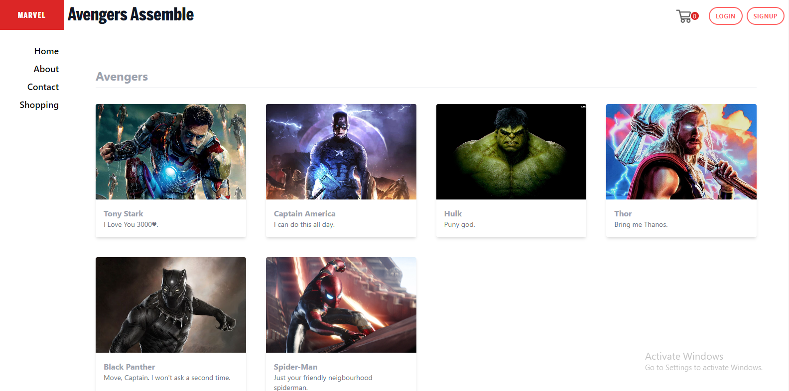

# Backend Code for Shopping_Cart
I have tried to organize the code using the MVC architecture.

## The following are a few aspets of the code. 
I have written the controllers inside the controllers.js file.  
I have written the routes inside the routes.js file.
***  

### I have created components for the following pages:
- Header  
- SideBar  
- Login
- Signup
- AddProduct
- Cart
